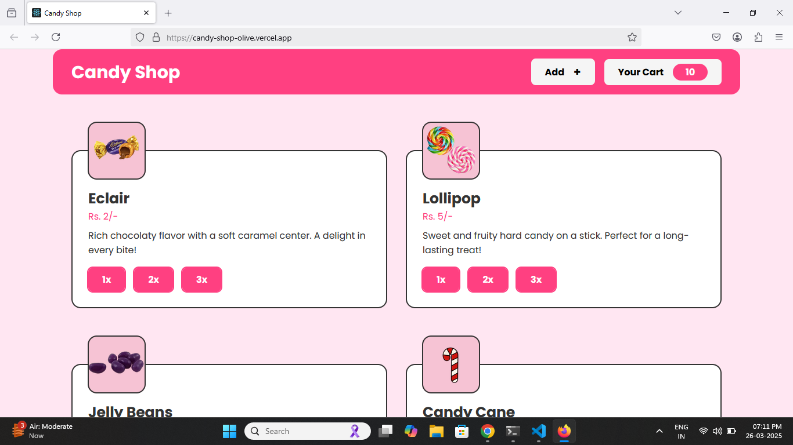
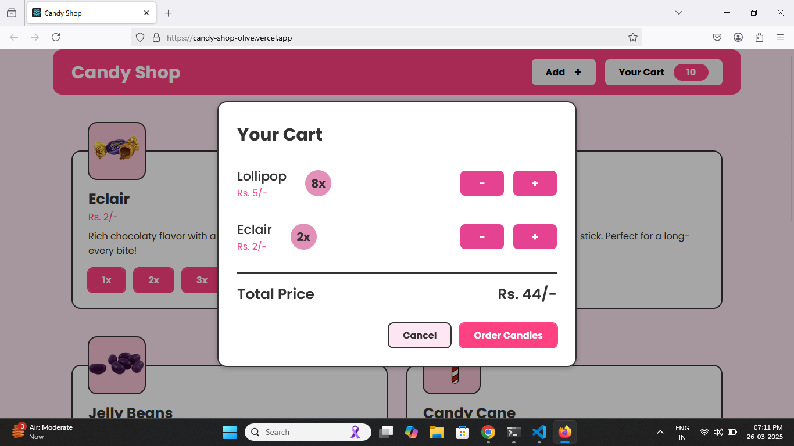
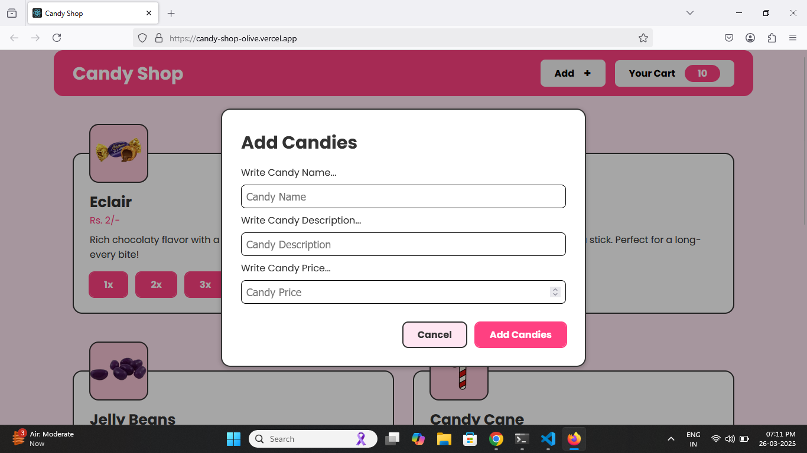
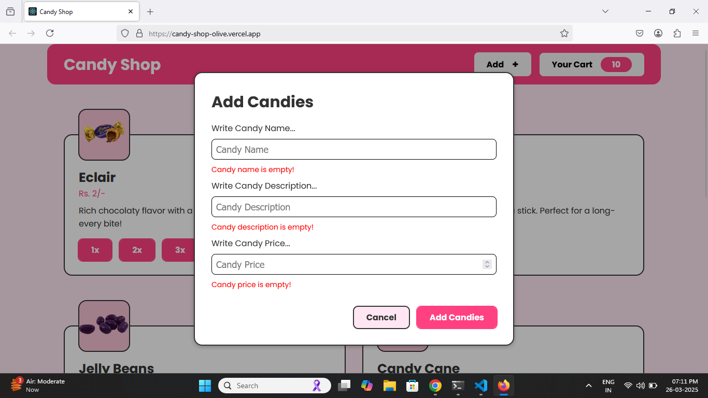

# Candy Shop

A delightful `Candy Shop` application where sellers can add new candies to the website with details like name, description, and price. Customers can explore the available candies, add them to their cart in different quantities, and keep track of their selected items with total price calculations.

* [Live Preview](https://candy-shop-olive.vercel.app/)
* [Design File](https://www.figma.com/design/p0HKPDRIYxxemTa4CFt8kJ/Candy-Shop?node-id=0-1&t=reHqPyIcTkg5nRsP-1)

## Built With

* React
* CSS
* JavaScript
* useContext

## Features

* Sellers can add candies with the following inputs:
    * Candy Name
    * Candy Description
    * Candy Price

* Customers can add candies to the cart in the following quantities:
    * 1 Candy
    * 2 Candies
    * 3 Candies

* Show added candies on the screen
* Show cart candies with total price
* Form validation for user input
* Fully responsive design

## Preview

